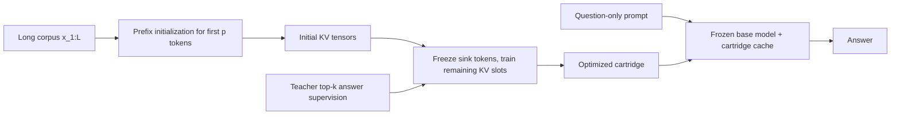

# Cartridges

This repo is a clean, single-GPU reproduction of the Cartridges idea: compress a long context into a trainable KV cache, then answer many follow-up questions against that compact cache instead of repeatedly paying full-context prefill cost.

The public entrypoints are:

- [run_benchmark.py](/mnt/ssd1/shreyansh/home_dir/cartridges/scripts/run_benchmark.py)
- [serve_vllm.py](/mnt/ssd1/shreyansh/home_dir/cartridges/scripts/serve_vllm.py)
- [check_env.py](/mnt/ssd1/shreyansh/home_dir/cartridges/scripts/check_env.py)

The standardized dataset layout is:

- `data/{experiment}/data.txt`
- `data/{experiment}/eval_spec.json`
- optional `data/{experiment}/metadata.json`

Tracked example datasets in this repo:

- [wikipedia_india/data.txt](/mnt/ssd1/shreyansh/home_dir/cartridges/data/wikipedia_india/data.txt)
- [wikipedia_india/eval_spec.json](/mnt/ssd1/shreyansh/home_dir/cartridges/data/wikipedia_india/eval_spec.json)
- [wikipedia_india/metadata.json](/mnt/ssd1/shreyansh/home_dir/cartridges/data/wikipedia_india/metadata.json)
- [wikipedia_history_us/data.txt](/mnt/ssd1/shreyansh/home_dir/cartridges/data/wikipedia_history_us/data.txt)
- [wikipedia_history_us/eval_spec.json](/mnt/ssd1/shreyansh/home_dir/cartridges/data/wikipedia_history_us/eval_spec.json)
- [wikipedia_history_us/metadata.json](/mnt/ssd1/shreyansh/home_dir/cartridges/data/wikipedia_history_us/metadata.json)

## Quickstart

Default run:

```bash
source .venv/bin/activate
CUDA_VISIBLE_DEVICES=3 python scripts/run_benchmark.py wikipedia_india
```

Explicit stable runs used in this repo:

```bash
source .venv/bin/activate
CUDA_VISIBLE_DEVICES=1 python scripts/run_benchmark.py wikipedia_history_us \
  --gpu 1 \
  --device cuda:0 \
  --run-name history_us_512_1024_stable \
  --cartridge-tokens 512 1024 \
  --train-steps 240 \
  --bootstrap-count 120 \
  --max-completion-tokens 48 \
  --chunk-tokens 8192 \
  --max-context-tokens 32768 \
  --semantic-judge
```

```bash
source .venv/bin/activate
CUDA_VISIBLE_DEVICES=3 python scripts/run_benchmark.py wikipedia_india \
  --gpu 3 \
  --device cuda:0 \
  --run-name india_1024_stable \
  --cartridge-tokens 1024 \
  --train-steps 240 \
  --bootstrap-count 120 \
  --max-completion-tokens 48 \
  --max-context-tokens 8192 \
  --semantic-judge
```

```bash
source .venv/bin/activate
CUDA_VISIBLE_DEVICES=3 python scripts/run_benchmark.py wikipedia_india \
  --gpu 3 \
  --device cuda:0 \
  --run-name india_512_stable \
  --cartridge-tokens 512 \
  --train-steps 240 \
  --bootstrap-count 120 \
  --max-completion-tokens 48 \
  --max-context-tokens 8192 \
  --semantic-judge
```

## What A Cartridge Is

The baseline system answers a question by feeding the whole corpus into the model every time. If the corpus has `L` tokens, the baseline KV cache size is proportional to `L`.

The cartridge system instead learns a compact cache with only `p` token positions:

```text
For layer l:

K_c^(l), V_c^(l) ∈ R^(n_kv_heads × p × d_head)
```

Where:

- `L` is the original context length
- `p` is the cartridge token budget, for example `512` or `1024`
- `n_kv_heads` is the model's KV-head count
- `d_head` is the attention head dimension

The byte footprint used throughout the repo is:

```text
kv_bytes(tokens) =
  tokens × num_hidden_layers × num_key_value_heads × head_dim × 2 × dtype_bytes
```

The reported compression ratio is therefore:

```text
compression_ratio = kv_bytes(full_context_prompt) / kv_bytes(cartridge)
```

For a routed multi-chunk corpus, the reported ratio is still:

- numerator: the KV bytes for the full-page baseline prompt
- denominator: the KV bytes for the one routed cartridge used to answer that question

So the ratio is still approximately `L / p`, adjusted for prompt framing tokens, but now `L` can be the full document while the cartridge is trained on only the routed chunk.

### Training Objective

The repo does not fine-tune the base model weights. It freezes the parent model and optimizes only the cartridge tensors.

At each answer position `t`, the teacher provides a sparse top-k target distribution `q_t(i)`. The cartridge is trained to minimize:

```text
L = - Σ_t Σ_i q_t(i) log p_theta(i | prompt, cartridge)
```

Where:

- `theta` are the frozen model weights
- `q_t(i)` is the sparse teacher distribution over candidate next tokens
- `p_theta(i | prompt, cartridge)` is the model distribution when the learned cartridge is injected as past KV state

This is implemented in [cartridge.py](/mnt/ssd1/shreyansh/home_dir/cartridges/src/cartridges/train/cartridge.py).

### Why Prefix Initialization Can Still Encode Later Facts

One point that is easy to miss: the cartridge is initialized from only the first `p` tokens of the chunk, but it is not constrained to remain "the KV cache of those first `p` tokens."

The actual sequence is:

1. Build full-context teacher supervision from the entire chunk embedded in the system prompt.
2. Initialize the cartridge from the first `p` tokens of that system prompt.
3. Freeze the base model weights and optimize only the cartridge K/V tensors so the small cartridge reproduces the teacher's answer distribution.

So the prefix pass gives the cartridge a sensible starting point, but the trainable slots are then free to move and become a learned compressed memory. After training, a cartridge slot no longer needs to correspond to one original token position in the source text. It can encode information that was originally spread across later parts of the chunk as long as doing so reduces the distillation loss.

## Cartridge Mechanics



The core cartridge object is [cartridge.py](/mnt/ssd1/shreyansh/home_dir/cartridges/src/cartridges/core/cartridge.py). The important details are:

- `initialize_from_prefix_text(...)` seeds the cartridge from the first `p` tokens of the corpus.
- `TrainableKVCartridge` stores one KV tensor pair per transformer layer.
- The first few positions can be frozen as attention-sink tokens.
- The remaining trainable positions are optimized against full-context teacher supervision, so they become a learned compressed memory rather than a literal copy of the initial prefix.
- `as_cache(...)` converts the saved tensors into the HF cache object used at inference time.

## End-To-End Flow

```mermaid
flowchart TD
    A[data/{experiment}/data.txt + eval_spec.json]
    B[build_text_manifest + build_eval_rows_from_spec]
    C[build_retrieval_index + route_eval_questions]
    D[start managed vLLM server]
    E[generate_bootstrap_questions per chunk]
    F[generate_teacher_answers per chunk]
    G[stop vLLM server]
    H[build_training_dataset per chunk]
    I[run_local_hf_matched_eval on full context]
    J[train_cartridge per chunk and budget]
    K[run routed run_cartridge_eval per budget]
    L[write_budget_report]
    M[write_run_report + run_manifest]

    A --> B
    B --> C
    C --> D
    D --> E --> F
    F --> G --> H
    B --> I
    C --> K
    H --> J
    I --> L
    J --> K
    K --> L
    L --> M
```

### Multi-Chunk Training Versus Inference Routing

For a multi-chunk corpus, this repo trains cartridges per slice, not jointly through the retriever.

- Training time: each chunk gets its own bootstrap questions, teacher answers, supervision dataset, and cartridge. So for one budget `p`, the runner trains one cartridge per chunk independently.
- Inference time: retrieval chooses one chunk for each held-out question, and the evaluator injects only that chunk's pre-trained cartridge.

So the current implementation is:

- one cartridge per `(slice_id, cartridge_budget)`
- no gradient routing across cartridges
- no joint "choose which cartridge to update" step during training
- top-1 retrieval only at evaluation/inference time

This means the retriever does not participate in training the cartridge tensors. It only selects which already-trained slice-specific cartridge should answer a given question.

## What `run_benchmark.py` Actually Does

When you run [run_benchmark.py](/mnt/ssd1/shreyansh/home_dir/cartridges/scripts/run_benchmark.py), the control flow is:

1. It resolves `data/{experiment}/` with [load_experiment_inputs(...)](/mnt/ssd1/shreyansh/home_dir/cartridges/src/cartridges/data/text_dataset.py).
2. It copies the input files into the run directory so the run stays self-contained.
3. It tokenizes `data.txt` into a manifest with [build_text_manifest(...)](/mnt/ssd1/shreyansh/home_dir/cartridges/src/cartridges/data/text_dataset.py).
4. It loads all chunk records with [load_corpus_slices(...)](/mnt/ssd1/shreyansh/home_dir/cartridges/src/cartridges/data/text_dataset.py).
5. It expands `eval_spec.json` into JSONL eval rows with [build_eval_rows_from_spec(...)](/mnt/ssd1/shreyansh/home_dir/cartridges/src/cartridges/data/text_dataset.py).
6. It embeds every chunk with [build_retrieval_index(...)](/mnt/ssd1/shreyansh/home_dir/cartridges/src/cartridges/benchmarks/text_benchmark.py) and routes held-out questions with [route_eval_questions(...)](/mnt/ssd1/shreyansh/home_dir/cartridges/src/cartridges/benchmarks/text_benchmark.py).
7. If `--base-url` is not provided, it launches [serve_vllm.py](/mnt/ssd1/shreyansh/home_dir/cartridges/scripts/serve_vllm.py) and waits for readiness.
8. For each chunk, it generates bootstrap question-answer candidates with [generate_bootstrap_questions(...)](/mnt/ssd1/shreyansh/home_dir/cartridges/src/cartridges/benchmarks/text_benchmark.py).
9. For each chunk, it materializes exact teacher answers with [generate_teacher_answers(...)](/mnt/ssd1/shreyansh/home_dir/cartridges/src/cartridges/benchmarks/text_benchmark.py).
10. It shuts down the managed vLLM server and clears lingering vLLM GPU workers before starting any local HF work.
11. For each chunk, it converts teacher answers into sparse token-level supervision with [build_training_dataset(...)](/mnt/ssd1/shreyansh/home_dir/cartridges/src/cartridges/benchmarks/text_benchmark.py).
12. It runs the full-context local baseline with [run_local_hf_matched_eval(...)](/mnt/ssd1/shreyansh/home_dir/cartridges/src/cartridges/eval/baseline.py).
13. For each requested cartridge budget and each chunk, it trains one cartridge with [train_cartridge(...)](/mnt/ssd1/shreyansh/home_dir/cartridges/src/cartridges/train/cartridge.py).
14. It evaluates each budget with routed [run_cartridge_eval(...)](/mnt/ssd1/shreyansh/home_dir/cartridges/src/cartridges/eval/cartridge.py), which injects the cartridge selected by retrieval for that question.
15. It merges baseline and routed-cartridge outputs into a per-budget report with [write_budget_report(...)](/mnt/ssd1/shreyansh/home_dir/cartridges/src/cartridges/benchmarks/text_benchmark.py).
16. It writes the aggregate multi-budget report with [write_run_report(...)](/mnt/ssd1/shreyansh/home_dir/cartridges/src/cartridges/benchmarks/text_benchmark.py).
17. It writes `run_manifest.json` and updates `outputs/{experiment}/latest`.

## Which File Implements What

The active benchmark path lives in these tracked files:

- [run_benchmark.py](/mnt/ssd1/shreyansh/home_dir/cartridges/scripts/run_benchmark.py): top-level orchestration, vLLM lifecycle, run directory management
- [serve_vllm.py](/mnt/ssd1/shreyansh/home_dir/cartridges/scripts/serve_vllm.py): thin wrapper around `vllm serve`
- [text_dataset.py](/mnt/ssd1/shreyansh/home_dir/cartridges/src/cartridges/data/text_dataset.py): input loading, multi-slice manifest construction, eval row materialization
- [common.py](/mnt/ssd1/shreyansh/home_dir/cartridges/src/cartridges/data/common.py): stable hashing and JSON/JSONL writing
- [text_benchmark.py](/mnt/ssd1/shreyansh/home_dir/cartridges/src/cartridges/benchmarks/text_benchmark.py): retrieval indexing, bootstrap generation, teacher answers, supervision dataset building, semantic judge, report writing
- [vllm_openai.py](/mnt/ssd1/shreyansh/home_dir/cartridges/src/cartridges/clients/vllm_openai.py): OpenAI-compatible vLLM client, tokenizer parity checks, optional teacher logprob fallback
- [cartridge.py](/mnt/ssd1/shreyansh/home_dir/cartridges/src/cartridges/core/cartridge.py): trainable KV cartridge object and prefix initialization
- [cartridge.py](/mnt/ssd1/shreyansh/home_dir/cartridges/src/cartridges/train/cartridge.py): distillation training loop and checkpoint selection
- [common.py](/mnt/ssd1/shreyansh/home_dir/cartridges/src/cartridges/eval/common.py): prompt building, exact-match scoring, canonical KV byte accounting
- [baseline.py](/mnt/ssd1/shreyansh/home_dir/cartridges/src/cartridges/eval/baseline.py): full-context baseline evaluation
- [cartridge.py](/mnt/ssd1/shreyansh/home_dir/cartridges/src/cartridges/eval/cartridge.py): routed cartridge-backed inference evaluation
- [config.py](/mnt/ssd1/shreyansh/home_dir/cartridges/src/cartridges/config.py): model and environment defaults

## Current Limits

- Routing is top-1 only: one question selects one chunk and one cartridge.
- The benchmark does not yet fuse evidence from multiple routed chunks or rerank a retrieved top-k set.
- The exact-match metric is intentionally strict. For long-answer datasets like the history page, the semantic judge is the more useful quality number when the model adds harmless wrappers like articles or punctuation.

## Benchmark Reports

The repo has the aggregate run reports for the following experiments:

### `wikipedia_history_us`

- Aggregate report: [comparison.md](/mnt/ssd1/shreyansh/home_dir/cartridges/outputs/wikipedia_history_us/runs/history_us_512_1024_stable/report/comparison.md)
- Aggregate summary: [summary.json](/mnt/ssd1/shreyansh/home_dir/cartridges/outputs/wikipedia_history_us/runs/history_us_512_1024_stable/report/summary.json)

### `cartridge_1024`

Observed numbers:

- Baseline exact match: `0.10`
- Cartridge exact match: `0.10`
- Baseline semantic match: `1.00`
- Cartridge semantic match: `1.00`
- Retrieval hit rate: `1.00`
- Compression ratio: `23.66x`
- Prefill speedup: `37.79x`
- End-to-end speedup: `6.00x`
- Baseline follow-up latency: `1171.22 ms`
- Cartridge follow-up latency: `209.97 ms`
- One-time build time: `401.03 s`

### `cartridge_512`

Observed numbers:

- Baseline exact match: `0.10`
- Cartridge exact match: `0.10`
- Baseline semantic match: `1.00`
- Cartridge semantic match: `0.85`
- Retrieval hit rate: `1.00`
- Compression ratio: `47.31x`
- Prefill speedup: `34.50x`
- End-to-end speedup: `5.30x`
- Baseline follow-up latency: `1171.22 ms`
- Cartridge follow-up latency: `344.31 ms`
- One-time build time: `401.31 s`

The `1024` budget is the better balanced result on this page: it keeps semantic quality at parity with the full-context baseline while still cutting follow-up latency by about `6x`.

### `wikipedia_india`

### `cartridge_1024`

- Aggregate report: [comparison.md](/mnt/ssd1/shreyansh/home_dir/cartridges/outputs/wikipedia_india/runs/india_1024_stable/report/comparison.md)
- Aggregate summary: [summary.json](/mnt/ssd1/shreyansh/home_dir/cartridges/outputs/wikipedia_india/runs/india_1024_stable/report/summary.json)

Observed numbers:

- Baseline exact match: `0.90`
- Cartridge exact match: `0.55`
- Baseline semantic match: `1.00`
- Cartridge semantic match: `1.00`
- Compression ratio: `8.07x`
- Prefill speedup: `8.19x`
- End-to-end speedup: `1.73x`
- Baseline follow-up latency: `400.84 ms`
- Cartridge follow-up latency: `238.40 ms`
- One-time build time: `125.35 s`

### `cartridge_512`

- Aggregate report: [comparison.md](/mnt/ssd1/shreyansh/home_dir/cartridges/outputs/wikipedia_india/runs/india_512_stable/report/comparison.md)
- Aggregate summary: [summary.json](/mnt/ssd1/shreyansh/home_dir/cartridges/outputs/wikipedia_india/runs/india_512_stable/report/summary.json)

Observed numbers:

- Baseline exact match: `0.90`
- Cartridge exact match: `0.45`
- Baseline semantic match: `1.00`
- Cartridge semantic match: `0.80`
- Compression ratio: `16.14x`
- Prefill speedup: `8.28x`
- End-to-end speedup: `1.76x`
- Baseline follow-up latency: `394.76 ms`
- Cartridge follow-up latency: `268.13 ms`
- One-time build time: `121.36 s`

## Other Generated Artifacts

This benchmark also produces many local artifacts (not in the repo):

- per-budget checkpoints
- JSONL predictions
- bootstrap question and teacher-answer files
- full run manifests
- vLLM logs

Those are written under `outputs/{experiment}/runs/{run_id}/`.

## References

```bibtex
@article{eyuboglu2025cartridges,
  title={Cartridges: Compressing Large-Scale Language Model Contexts with Continual Memory},
  author={Eyuboglu, Sabri and others},
  journal={arXiv preprint arXiv:2506.06266},
  year={2025},
  url={https://arxiv.org/abs/2506.06266}
}
```
