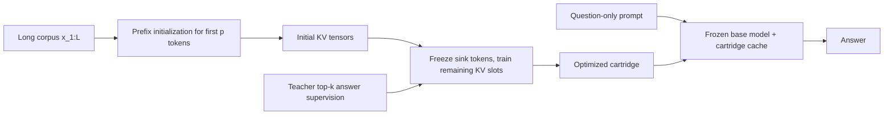
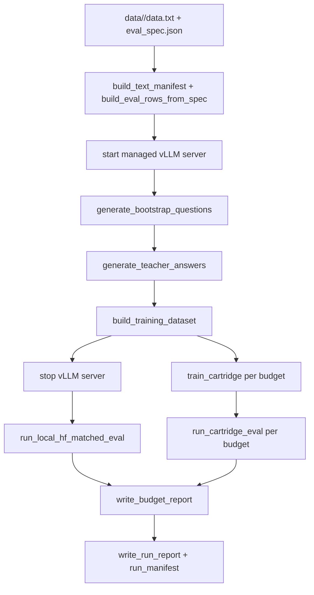

# Cartridges

This repo is a clean, single-GPU reproduction of the Cartridges idea: compress a long context into a trainable KV cache, then answer many follow-up questions against that compact cache instead of repeatedly paying full-context prefill cost.

The public entrypoints are:

- [run_benchmark.py](/mnt/ssd1/shreyansh/home_dir/cartridges/scripts/run_benchmark.py)
- [serve_vllm.py](/mnt/ssd1/shreyansh/home_dir/cartridges/scripts/serve_vllm.py)
- [check_env.py](/mnt/ssd1/shreyansh/home_dir/cartridges/scripts/check_env.py)

The standardized dataset layout is:

- [data.txt](/mnt/ssd1/shreyansh/home_dir/cartridges/data/wikipedia_india/data.txt)
- [eval_spec.json](/mnt/ssd1/shreyansh/home_dir/cartridges/data/wikipedia_india/eval_spec.json)
- [metadata.json](/mnt/ssd1/shreyansh/home_dir/cartridges/data/wikipedia_india/metadata.json)

## Quickstart

Default run:

```bash
source .venv/bin/activate
CUDA_VISIBLE_DEVICES=3 python scripts/run_benchmark.py wikipedia_india
```

Explicit stable runs used in this repo:

```bash
source .venv/bin/activate
CUDA_VISIBLE_DEVICES=3 python scripts/run_benchmark.py wikipedia_india \
  --gpu 3 \
  --device cuda:0 \
  --run-name india_1024_stable \
  --cartridge-tokens 1024 \
  --train-steps 240 \
  --bootstrap-count 120 \
  --max-completion-tokens 48 \
  --max-context-tokens 8192 \
  --semantic-judge
```

```bash
source .venv/bin/activate
CUDA_VISIBLE_DEVICES=3 python scripts/run_benchmark.py wikipedia_india \
  --gpu 3 \
  --device cuda:0 \
  --run-name india_512_stable \
  --cartridge-tokens 512 \
  --train-steps 240 \
  --bootstrap-count 120 \
  --max-completion-tokens 48 \
  --max-context-tokens 8192 \
  --semantic-judge
```

## What A Cartridge Is

The baseline system answers a question by feeding the whole corpus into the model every time. If the corpus has `L` tokens, the baseline KV cache size is proportional to `L`.

The cartridge system instead learns a compact cache with only `p` token positions:

```text
For layer l:

K_c^(l), V_c^(l) ∈ R^(n_kv_heads × p × d_head)
```

Where:

- `L` is the original context length
- `p` is the cartridge token budget, for example `512` or `1024`
- `n_kv_heads` is the model's KV-head count
- `d_head` is the attention head dimension

The byte footprint used throughout the repo is:

```text
kv_bytes(tokens) =
  tokens × num_hidden_layers × num_key_value_heads × head_dim × 2 × dtype_bytes
```

The reported compression ratio is therefore:

```text
compression_ratio = kv_bytes(full_context_prompt) / kv_bytes(cartridge)
```

For a single-chunk corpus, this is approximately `L / p`, adjusted for prompt framing tokens.

### Training Objective

The repo does not fine-tune the base model weights. It freezes the parent model and optimizes only the cartridge tensors.

At each answer position `t`, the teacher provides a sparse top-k target distribution `q_t(i)`. The cartridge is trained to minimize:

```text
L = - Σ_t Σ_i q_t(i) log p_theta(i | prompt, cartridge)
```

Where:

- `theta` are the frozen model weights
- `q_t(i)` is the sparse teacher distribution over candidate next tokens
- `p_theta(i | prompt, cartridge)` is the model distribution when the learned cartridge is injected as past KV state

This is implemented in [cartridge.py](/mnt/ssd1/shreyansh/home_dir/cartridges/src/cartridges/train/cartridge.py).

## Cartridge Mechanics



The core cartridge object is [cartridge.py](/mnt/ssd1/shreyansh/home_dir/cartridges/src/cartridges/core/cartridge.py). The important details are:

- `initialize_from_prefix_text(...)` seeds the cartridge from the first `p` tokens of the corpus.
- `TrainableKVCartridge` stores one KV tensor pair per transformer layer.
- The first few positions can be frozen as attention-sink tokens.
- `as_cache(...)` converts the saved tensors into the HF cache object used at inference time.

## End-To-End Flow



## What `run_benchmark.py` Actually Does

When you run [run_benchmark.py](/mnt/ssd1/shreyansh/home_dir/cartridges/scripts/run_benchmark.py), the control flow is:

1. It resolves `data/<experiment>/` with [load_experiment_inputs(...)](/mnt/ssd1/shreyansh/home_dir/cartridges/src/cartridges/data/text_dataset.py).
2. It copies the input files into the run directory so the run stays self-contained.
3. It tokenizes `data.txt` into a manifest with [build_text_manifest(...)](/mnt/ssd1/shreyansh/home_dir/cartridges/src/cartridges/data/text_dataset.py).
4. It expands `eval_spec.json` into JSONL eval rows with [build_eval_rows_from_spec(...)](/mnt/ssd1/shreyansh/home_dir/cartridges/src/cartridges/data/text_dataset.py).
5. If `--base-url` is not provided, it launches [serve_vllm.py](/mnt/ssd1/shreyansh/home_dir/cartridges/scripts/serve_vllm.py) and waits for readiness.
6. It generates bootstrap question-answer candidates from the corpus with [generate_bootstrap_questions(...)](/mnt/ssd1/shreyansh/home_dir/cartridges/src/cartridges/benchmarks/text_benchmark.py).
7. It materializes exact teacher answers with [generate_teacher_answers(...)](/mnt/ssd1/shreyansh/home_dir/cartridges/src/cartridges/benchmarks/text_benchmark.py).
8. It converts those answers into sparse token-level supervision with [build_training_dataset(...)](/mnt/ssd1/shreyansh/home_dir/cartridges/src/cartridges/benchmarks/text_benchmark.py).
9. It shuts down the managed vLLM server so local HF training and evaluation can reuse the GPU cleanly.
10. It runs the full-context local baseline with [run_local_hf_matched_eval(...)](/mnt/ssd1/shreyansh/home_dir/cartridges/src/cartridges/eval/baseline.py).
11. For each requested cartridge budget, it trains a cartridge with [train_cartridge(...)](/mnt/ssd1/shreyansh/home_dir/cartridges/src/cartridges/train/cartridge.py).
12. It evaluates that cartridge with [run_cartridge_eval(...)](/mnt/ssd1/shreyansh/home_dir/cartridges/src/cartridges/eval/cartridge.py).
13. It merges baseline and cartridge outputs into a per-budget report with [write_budget_report(...)](/mnt/ssd1/shreyansh/home_dir/cartridges/src/cartridges/benchmarks/text_benchmark.py).
14. It writes the aggregate multi-budget report with [write_run_report(...)](/mnt/ssd1/shreyansh/home_dir/cartridges/src/cartridges/benchmarks/text_benchmark.py).
15. It writes `run_manifest.json` and updates `outputs/<experiment>/latest`.

## Which File Implements What

The active benchmark path lives in these tracked files:

- [run_benchmark.py](/mnt/ssd1/shreyansh/home_dir/cartridges/scripts/run_benchmark.py): top-level orchestration, vLLM lifecycle, run directory management
- [serve_vllm.py](/mnt/ssd1/shreyansh/home_dir/cartridges/scripts/serve_vllm.py): thin wrapper around `vllm serve`
- [text_dataset.py](/mnt/ssd1/shreyansh/home_dir/cartridges/src/cartridges/data/text_dataset.py): input loading, manifest construction, eval row materialization
- [common.py](/mnt/ssd1/shreyansh/home_dir/cartridges/src/cartridges/data/common.py): stable hashing and JSON/JSONL writing
- [text_benchmark.py](/mnt/ssd1/shreyansh/home_dir/cartridges/src/cartridges/benchmarks/text_benchmark.py): bootstrap generation, teacher answers, supervision dataset building, semantic judge, report writing
- [vllm_openai.py](/mnt/ssd1/shreyansh/home_dir/cartridges/src/cartridges/clients/vllm_openai.py): OpenAI-compatible vLLM client, tokenizer parity checks, optional teacher logprob fallback
- [cartridge.py](/mnt/ssd1/shreyansh/home_dir/cartridges/src/cartridges/core/cartridge.py): trainable KV cartridge object and prefix initialization
- [cartridge.py](/mnt/ssd1/shreyansh/home_dir/cartridges/src/cartridges/train/cartridge.py): distillation training loop and checkpoint selection
- [common.py](/mnt/ssd1/shreyansh/home_dir/cartridges/src/cartridges/eval/common.py): prompt building, exact-match scoring, canonical KV byte accounting
- [baseline.py](/mnt/ssd1/shreyansh/home_dir/cartridges/src/cartridges/eval/baseline.py): full-context baseline evaluation
- [cartridge.py](/mnt/ssd1/shreyansh/home_dir/cartridges/src/cartridges/eval/cartridge.py): cartridge-backed inference evaluation
- [config.py](/mnt/ssd1/shreyansh/home_dir/cartridges/src/cartridges/config.py): model and environment defaults

## Current Limits

- The benchmark currently assumes the corpus fits into exactly one chunk.
- The tracked reports are checked in, but most generated artifacts are intentionally ignored:
  checkpoints, JSONL predictions, bootstrap intermediate files, and per-run manifests stay local.
- The compression win primarily appears in prefill and follow-up latency, not decode throughput.

## Checked-In Benchmark Reports

The repo currently checks in only the aggregate report files for the two stable India runs.

### `cartridge_1024`

- Aggregate report: [comparison.md](/mnt/ssd1/shreyansh/home_dir/cartridges/outputs/wikipedia_india/runs/india_1024_stable/report/comparison.md)
- Aggregate summary: [summary.json](/mnt/ssd1/shreyansh/home_dir/cartridges/outputs/wikipedia_india/runs/india_1024_stable/report/summary.json)

Observed numbers:

- Baseline exact match: `0.90`
- Cartridge exact match: `0.55`
- Baseline semantic match: `1.00`
- Cartridge semantic match: `1.00`
- Compression ratio: `8.07x`
- Prefill speedup: `8.19x`
- End-to-end speedup: `1.73x`
- Baseline follow-up latency: `400.84 ms`
- Cartridge follow-up latency: `238.40 ms`
- One-time build time: `125.35 s`

### `cartridge_512`

- Aggregate report: [comparison.md](/mnt/ssd1/shreyansh/home_dir/cartridges/outputs/wikipedia_india/runs/india_512_stable/report/comparison.md)
- Aggregate summary: [summary.json](/mnt/ssd1/shreyansh/home_dir/cartridges/outputs/wikipedia_india/runs/india_512_stable/report/summary.json)

Observed numbers:

- Baseline exact match: `0.90`
- Cartridge exact match: `0.45`
- Baseline semantic match: `1.00`
- Cartridge semantic match: `0.80`
- Compression ratio: `16.14x`
- Prefill speedup: `8.28x`
- End-to-end speedup: `1.76x`
- Baseline follow-up latency: `394.76 ms`
- Cartridge follow-up latency: `268.13 ms`
- One-time build time: `121.36 s`

## Other Generated Artifacts

This benchmark also produces many local artifacts (not in the repo):

- per-budget checkpoints
- JSONL predictions
- bootstrap question and teacher-answer files
- full run manifests
- vLLM logs

Those are written under `outputs/<experiment>/runs/<run_id>/`.
